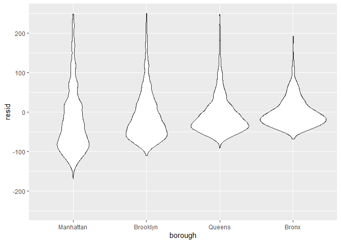

Linear_Models
================
Shun Xie
2022-11-10

``` r
library(tidyverse)
```

    ## ── Attaching packages ─────────────────────────────────────── tidyverse 1.3.2 ──
    ## ✔ ggplot2 3.3.6      ✔ purrr   0.3.4 
    ## ✔ tibble  3.1.8      ✔ dplyr   1.0.10
    ## ✔ tidyr   1.2.0      ✔ stringr 1.4.1 
    ## ✔ readr   2.1.2      ✔ forcats 0.5.2 
    ## ── Conflicts ────────────────────────────────────────── tidyverse_conflicts() ──
    ## ✖ dplyr::filter() masks stats::filter()
    ## ✖ dplyr::lag()    masks stats::lag()

``` r
library(p8105.datasets)

set.seed(1)
```

``` r
data("nyc_airbnb")

nyc_airbnb = 
  nyc_airbnb %>% 
  mutate(stars = review_scores_location / 2) %>% 
  rename(
    borough = neighbourhood_group,
    neighborhood = neighbourhood) %>% 
  filter(borough != "Staten Island") %>% 
  select(price, stars, borough, neighborhood, room_type)
```

``` r
fit = lm(price ~ stars + borough, data = nyc_airbnb)
```

``` r
fit %>% 
  broom::tidy() %>% 
  mutate(term = str_replace(term, "borough","Borough: ")) %>% 
  select(term,estimate,p.value) %>% 
  knitr::kable(digits=2)
```

| term               | estimate | p.value |
|:-------------------|---------:|--------:|
| (Intercept)        |   -70.41 |    0.00 |
| stars              |    31.99 |    0.00 |
| Borough: Brooklyn  |    40.50 |    0.00 |
| Borough: Manhattan |    90.25 |    0.00 |
| Borough: Queens    |    13.21 |    0.15 |

``` r
#when we pipe:
fit = 
  nyc_airbnb %>% 
  lm(price~stars+borough, data=.)
```

change freq:

``` r
#most common in category 1, then category 2
nyc_airbnb= nyc_airbnb %>% 
  mutate(
    borough = fct_infreq(borough)
  )
```

``` r
fit %>% 
  broom::glance() %>% 
  select(AIC)
```

    ## # A tibble: 1 × 1
    ##       AIC
    ##     <dbl>
    ## 1 404237.

## Diagnosis

``` r
modelr::add_residuals(nyc_airbnb, fit) %>% 
  ggplot(aes(x=stars, y =resid))+
  geom_point()
```

    ## Warning: Removed 9962 rows containing missing values (geom_point).

<!-- -->

``` r
nyc_airbnb %>% 
  modelr::add_residuals(fit) %>% 
  ggplot(aes(x=borough,y=resid))+
  geom_violin()+
  ylim(-250,250)
```

    ## Warning: Removed 10862 rows containing non-finite values (stat_ydensity).

<!-- -->

## Hypothesis test

``` r
fit %>% 
  broom::tidy()
```

    ## # A tibble: 5 × 5
    ##   term             estimate std.error statistic  p.value
    ##   <chr>               <dbl>     <dbl>     <dbl>    <dbl>
    ## 1 (Intercept)         -70.4     14.0      -5.02 5.14e- 7
    ## 2 stars                32.0      2.53     12.7  1.27e-36
    ## 3 boroughBrooklyn      40.5      8.56      4.73 2.23e- 6
    ## 4 boroughManhattan     90.3      8.57     10.5  6.64e-26
    ## 5 boroughQueens        13.2      9.06      1.46 1.45e- 1

``` r
fit_null = lm(price~stars, data = nyc_airbnb)
fit_alt = lm(price~ stars+borough, data = nyc_airbnb)

anova(fit_null, fit_alt)
```

    ## Analysis of Variance Table
    ## 
    ## Model 1: price ~ stars
    ## Model 2: price ~ stars + borough
    ##   Res.Df        RSS Df Sum of Sq      F    Pr(>F)    
    ## 1  30528 1030861841                                  
    ## 2  30525 1005601724  3  25260117 255.59 < 2.2e-16 ***
    ## ---
    ## Signif. codes:  0 '***' 0.001 '**' 0.01 '*' 0.05 '.' 0.1 ' ' 1

``` r
fit_new = nyc_airbnb %>% 
  lm(price ~ stars + room_type * borough, data = .) %>% 
  broom::tidy() %>% 
  knitr::kable(digits = 3)
```

``` r
fit %>% broom::tidy()
```

    ## # A tibble: 5 × 5
    ##   term             estimate std.error statistic  p.value
    ##   <chr>               <dbl>     <dbl>     <dbl>    <dbl>
    ## 1 (Intercept)         -70.4     14.0      -5.02 5.14e- 7
    ## 2 stars                32.0      2.53     12.7  1.27e-36
    ## 3 boroughBrooklyn      40.5      8.56      4.73 2.23e- 6
    ## 4 boroughManhattan     90.3      8.57     10.5  6.64e-26
    ## 5 boroughQueens        13.2      9.06      1.46 1.45e- 1

Do each time:

``` r
nyc_airbnb %>% 
  nest(df = -borough) %>% 
  mutate(models = map(.x = df, ~lm(price~stars+room_type, data = .x)))
```

    ## # A tibble: 4 × 3
    ##   borough   df                    models
    ##   <fct>     <list>                <list>
    ## 1 Bronx     <tibble [649 × 4]>    <lm>  
    ## 2 Queens    <tibble [3,821 × 4]>  <lm>  
    ## 3 Brooklyn  <tibble [16,810 × 4]> <lm>  
    ## 4 Manhattan <tibble [19,212 × 4]> <lm>
